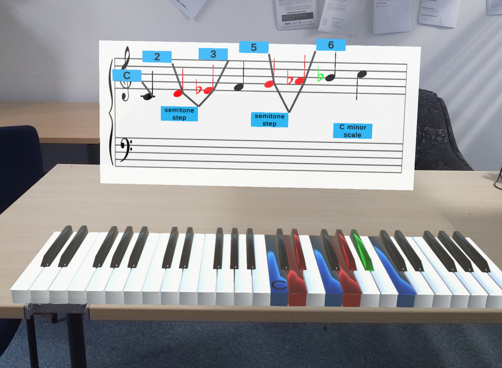

# Music Vision

The development of this application was the focus of my bachelor's thesis. It is an e-learning app prototype that tries to create a more immersive approach to the teaching of music theory by targeting the augmented reality platform [Hololens 2][H2]. It was developed in the [Unity3D][Unity] game engine using the [Microsoft Mixed Reality Toolkit][MRTK] (Version 2).

The `Music Vision` directory contains the Unity project while the LaTex source code for the thesis together with results from a user study and other related material can be found in the `Thesis Related Data` directory. `Wings 3D Piano Key Models ` contains the project files for the 3D models of the piano keys which I had to create myself.

The application can be deployed by [building it in Unity][UDeploy] first and then [deploying it onto the Hololens 2 device][VSDeploy]. Alternatively it can be run within Unity through the regular play mode.
> When using the Unity play mode, the `TP` game object must be enabled first to have a surface the keyboard can stick to. Unfortunately, some features like text-to-speech (the text will be printed to the console instead) and voice input won't work in the play mode. Additionally, the screen space text will be too large as it scales differently when deployed. Instead of voice commands, the following key bindings are used as mock input:

<table>
<tr><th> Control Commands </th><th> Note Commands </th></tr>
<tr><td>

Voic Command | Key              
:---: | :---:
continue | right arrow
skip | up arrow
exit | down arrow
repeat | left arrow

</td><td>

Voice Command | Key              
:---: | :---:
C - B | C - B
C # - B # | keypad 1 - 7
C ♭ - B ♭ | numpad 1 - 7
major | +
minor | -

</td></tr> </table>

[H2]: <https://www.microsoft.com/en-us/hololens>
[Unity]: <https://unity.com/>
[MRTK]: <https://docs.microsoft.com/en-us/windows/mixed-reality/mrtk-unity/mrtk2>
[UDeploy]: <https://learn.microsoft.com/en-us/windows/mixed-reality/develop/unity/build-and-deploy-to-hololens>
[VSDeploy]: <https://learn.microsoft.com/en-us/windows/mixed-reality/develop/advanced-concepts/using-visual-studio>
